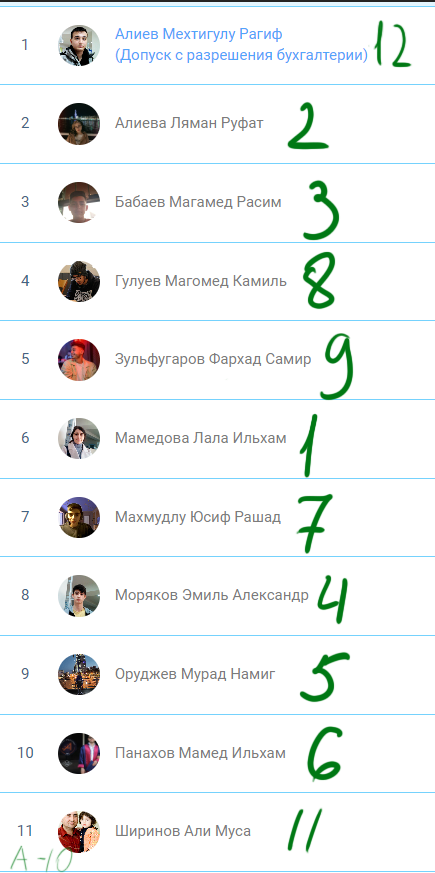

# Тема урока. Процессы и Windows

### Что такое процесс ?
Процесс - это выполнение программы, при это одна программа может иметь несколько процессов. Процесс состоит из следующих элементов:
* executable code - исполняемый код
* Потоки

### Что такое исполняемый код ?
Исполняемый код - это набор инструкций, который выполняется на какой либо платформе.
Это может быть как уже скомпилированный `.exe` файл, так и скрипт, который выполняется интерпретатором.
Исполняемый файл может быть и `.sh` файлом, который выполняется в `bash` интерпретаторе.

### Что такое поток ?
Поток - это действие, которые выполняются в рамках процесса.
Поток, создает ваша `OS`. Один процесс может состоять из нескольких потоков.

Интересный факт - У каждого потока свой `Stack`, но общий `Heap`.

При запуске программы, создается один главный поток. Как мы привыкли работать в С++, 
там у нас был один main(), следовательно мы не создваали никаких потоков и у нас был один `Stack`.

## Как это работает в C# ?

В C#, при создании проекта сразу запускается несколько потоков, НО мы работаем в одном главном потоке.
Остальные потоки мы по факту не видим, но они есть. 

## Подробнее о потоках

Процессор - состоит из ядер.
Например: Мой процессор Intel Core i7-9750H имеет 6 ядер.
Каждое ядро может выполнять одно действие за раз.

### То есть в моем компьютере за один момент времени параллельно может выполняться 6 действий.

При этом на картинке видно 12 CPU. Получается что одно ядро умножается на 2 потока.
Эти два потока называются `Hyper-Threading`.

### Что такое Hyper-Threading ?

Hyper-Threading - это технология, которая позволяет одному ядру процессора выполнять два потока одновременно.
То есть, если у вас 6 ядер, то вы можете выполнять 12 потоков одновременно.

Технологию Hyper-Threading создали в компании Intel, но она есть и у AMD, но называется она `SMT`.

### Почему одно ядро может выполнять только два потока ?

Потому что у каждого ядра есть два конвейера, которые разделяются на одну часть для каждого потока.
По сути если в вашем дома есть два выхода, то одновременно оттдуа могут выйти только два человека.

# ВАЖНО
Есть процессоры, которые не имеют технологии Hyper-Threading, то есть у них нет двух конвейеров.

### Как так получается, что 6 ядерный процессор может выполнять 5000 операций в одно время ?

Потому что у каждого ядра есть тактовая частота.
Тактовая частота - это скорость, с которой процессор выполняет операции.
Чем больше Ghz у процессора, тем быстрее он выполняет операции.

### Для окончательного понятия пройдем следующие темы: 
* Многопоточность
* Асинхронность
* Реактивность

Все, что я описал сверху, это параллелизм. 
Параллелизм - это когда одновременно выполняется несколько операций.

# Многопоточность
Когда в нашей программе, мы создаем несколько потоков, которые
могут работать как над одной задачей, так и над разными,
именно из-за этого не стоит путать его с многозадачностью.

# Асинхронность 
Асинхронность - это когда мы выполняем несколько задач, но не одновременно,
а асинхронно. 

