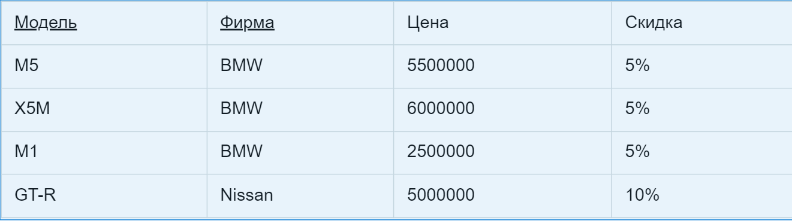
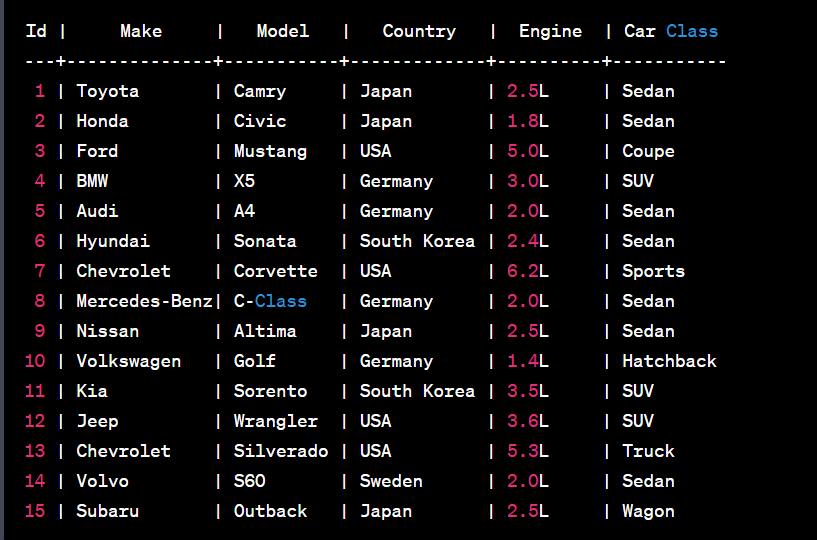

# Lesson 13. Нормализация и нормальные формы
## P.S. Все что я скажу на этом уроке очень важно...

Не звбываем...

Всего есть 6 нормальных форм, но перед тем как понять их, надо понять зачем нормализация вообще нужна ? 

Ничего особо плохого в техническом плане не произойдет, если вс е будет в одной таблице, НО есть проблемы с большими данными 
Также есть проблема с данными, которые часто должны обновляться

Все в SQL про отношения, именно из-за этого он назывется реляционной базой данных

По идее можно все сгруппировать в одной таблице и жить своей жизнью, но это не правильно.

Давайте рассмотрим проблемы, которые могут возникнуть...

#### Проблемы: 
- Дублирование данных
- Проблемы с обновлением данных
- Проблемы с удалением данных
- Проблемы с добавлением данных
- Проблемы с поиском данных
- Проблемы с сортировкой данных
- Проблемы с индексами
- Проблемы с производительностью
- Проблемы с целостностью данных
- Проблемы с безопасностью данных
- Проблемы с масштабируемостью

Если бы нормализация была бы панацеей, не было бы денормализации.

У Денормализации есть свои плюсы и минусы, но она необходима в некоторых случаях.
Плюсы: 
- Ускорение запросов
- Уменьшение количества запросов
- Уменьшение количества таблиц
- Уменьшение количества связей
- Меньшее использование памяти

#### Для того, чтобы привести базу данных в порядок есть нормальные формы.
Не забываем, то что нормальные формы это не набор правил, а набор условий, которые должны выполняться.

####  Всего есть 6 нормальных форм:
- Первая нормальная форма (1NF)
- Вторая нормальная форма (2NF)
- Третья нормальная форма (3NF)
- Нормальная форма Бойса-Кодда (BCNF)
- Четвертая нормальная форма (4NF)
- Пятая нормальная форма (5NF)
- Шестая нормальная форма (6NF)

### Не нормальная форма (0NF)

### Первая нормальная форма (1NF)

### Вторая нормальная форма (2NF)

Таблица все еще в первой

Таблицы во второй нормальной форме, путем декомпозиции первой
и отделения атрибутов, которые не полностью зависят от первичного ключа

### Третья нормальная форма (3NF)

Таблица находится во 2НФ, но не в 3НФ.
В отношении атрибут «Модель» является первичным ключом. Личных телефонов у автомобилей нет, и телефон зависит исключительно от магазина.
Таким образом, в отношении существуют следующие функциональные зависимости: Модель → Магазин, Магазин → Телефон, Модель → Телефон.
Зависимость Модель → Телефон является транзитивной, следовательно, отношение не находится в 3НФ.
В результате разделения исходного отношения получаются два отношения, находящиеся в 3НФ:

### Нормальная форма Бойса-Кодда (BCNF)

### Четвертая нормальная форма (4NF)

