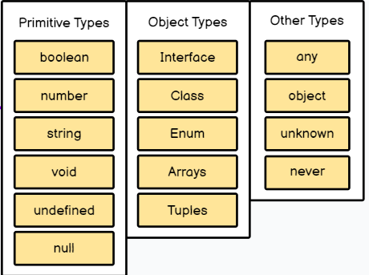

# Тема урока: Введение в TypeScript

Как вы уже поняли с наших прошлых уроков. 
Существует стандарт, которому должен соответствовать
JS. Это стандарт ECMAScript. Последняя версия стандарта
это ES6

TypeScript - это язык программирования, который
представляет собой надстройку над JS. Он позволяет
нам писать код, который будет соответствовать
стандарту ES6.

Он был создан компанией Microsoft в 2012 году.
Основной целью создания языка было упростить
разработку больших приложений. Сейчас он очень активно 
используется в разработке Angular приложений, а также 
React и Node.js.

По моему мнению, если вы .NET разработчик, то вам
будет очень удобно и просто работать на TypeScript.

Можно ли подключить TypeScript к html файлу?
Да, можно. Но с начала давайте разберемся с основами этого языка.

## Установка TypeScript

Для начала нам нужно установить TypeScript. Для этого
нам нужно установить Node.js. После установки Node.js
вы можете проверить версию Node.js и npm в консоли
командой:

```bash
node -v
npm -v
```

После установки Node.js, нам нужно установить TypeScript
командой:

```bash
npm install -g typescript
```

тут -g означает, что мы устанавливаем TypeScript глобально.

После установки TypeScript, мы можем проверить его версию
командой:

```bash
tsc -v
```

### [Документация TypeScript](https://www.typescriptlang.org/docs/)

# [Ссылка на roadmap](https://roadmap.sh/typescript) 

### TypeScript vs JavaScript
* Строгая типизация
* Инструменты 
* Интерфейсы как в C# 
* Обратная совместимость с JS

По сути вы должны понимать то под капотом это все одно и тоже. 

Браузер что Js что Ts воспринимает одинаково как язык стандарта ECMAScript.

### Типы данных в TypeScript


#### Примитивные типы данных
* `boolean` - логический тип данных. Принимает значения true или false.
* `number` - числовой тип данных. Все числа в TypeScript являются числами с плавающей точкой.
* `string` - строковый тип данных. Строка может содержать символы, цифры и специальные символы.
* `void` - тип данных, который обычно используется в качестве возвращаемого значения функции. 
* `undefined` - тип данных, который имеет значение undefined.
* `null` - тип данных, который имеет значение null.

#### Объектные типы данных

* `interface` - интерфейс. Интерфейс - это набор свойств и методов, которые описывают объект.
* `class` - класс. Класс - это расширяемый шаблон кода для создания объектов, который устанавливает начальные значения (свойства) и реализацию поведения (методы).
* `array` - массив. Массив - это объект, который используется для хранения набора значений различных типов.
* `tuple` - кортеж. Кортеж - это массив, который имеет фиксированное количество элементов, и каждый элемент может иметь разный тип данных.
* `enum` - перечисление. Перечисление - это набор именованных числовых констант.

#### Условные типы данных
* `any` - любой тип данных. Используется для обозначения переменной, значение которой будет установлено в процессе выполнения программы.
* `unknown` - неизвестный тип данных. Похож на any, но нельзя присвоить переменной тип unknown никакое другое значение.
* `never` - тип данных, который указывает, что функция никогда не возвращает значение.
* `object` - тип данных, который представляет собой не примитивный тип данных, любой тип данных, который не является number, string, boolean, bigint, symbol, null или undefined.

#  Подробнее

Как понять `any` и `unknown` ?

```ts
let a: any = 1;
let b: unknown = 1;

a = '1';

b = '1';

let c: string = a;

let d: string = b;
```

В данном примере мы можем присвоить переменной `a` любое значение,
так как мы указали, что это переменная типа `any`. А вот переменной
`b` мы не можем присвоить значение типа `string`, так как мы указали,
что это переменная типа `unknown`.

Также мы можем присвоить переменной `c` значение переменной `a`,
так как мы указали, что переменная `a` имеет тип `any`. А вот
переменной `d` мы не можем присвоить значение переменной `b`,
так как мы указали, что переменная `b` имеет тип `unknown`.

Вы спросите где мы будем использовать `unknown` ? 

Допустим у нас есть функция, которая принимает параметр типа `unknown`.
Внутри этой функции мы можем проверить тип параметра и в зависимости
от типа выполнить какие-то действия, но нам нельзя менять этот параметр. 
`unknown` - в таком случае подходит идеально. По сути это инкапсулированный `any`.

`never` VS `void` ?

```ts
function throwError(): never {
  throw new Error('error');
}

function show(): void {
  console.log('show');
}
```

Вы будете использовать использовать `never` в тех случаях, когда вы точно знаете, что функция 
никогда не вернет значение. Например, функция, которая бросает ошибку. 
К примеру вы скачиваете данных с сервера и пишите две функции. `resolve` и `reject`.

Вот для `reject` вы напишите функцию, которая будет бросать ошибку. Соответственно тип данных 
там будет `never`. А вот для `resolve` вы напишите функцию, которая будет возвращать данные.

## Assertions 
* `as`
* `as const`
* `as any`

Если вы хотите привести тип у вас есть три варианта. 

```ts
let a: any = 1;
let b: number = a as number;
let c: number = <number> a;
```

Разница между `as` и `<number>` в том, что `<number>` используется в JSX.

```ts
let a = 1;

let b = a as const;
```

`as const` - это то же самое, что и `const a = 1;`

```ts
let a = 1;

let b = a as any;
```

`as any` - это то же самое, что и `let b: any = a;`


## Non-null assertion operator

```ts
let a: number | null = 1;

let b = a!;
```

`!` - это то же самое, что и `let b: number = a;`

В C# это выглядело бы так:

```csharp
int? a = 1;

int b = a.Value;
```

Если бы я написал так:

```ts

let a: number | null = null;

let b = a!;
```

То у меня бы вылетела ошибка, так как я пытаюсь присвоить переменной `b` значение `null`.


## Ключевое слово `satisfies`

```ts

let a: number | null = 1;

let b = a!;

let c = a satisfies number;
```

`c` будет иметь тип `boolean` и значение `true`.

В C# это было бы так 
    
```csharp

int a = 1;

bool b = a is int;
```

## Type inference

```ts
let a = 1;
```

`a` будет иметь тип `number`.

По сути тут ничего сложного нет. Просто компилятор сам определяет тип данных, если его не писать.
Но я люблю писать типы данных, так как это улучшает читаемость кода.

