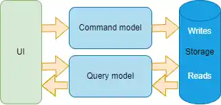

# CQRS

`CQRS` - Command Query Responsibility Segregation
Этот паттерн разделяет модель приложения на две части: 
1. командную 
2. запросную.

Командная часть отвечает за изменение состояния, а запросная - за его получение.

## Когда нам нужно внедрять этот паттерн ?

Если вы видите, что запросы к вашему приложению становятся ассиметричными, то есть запросы на чтение данных становятся гораздо чаще, чем запросы на изменение данных, то это может быть сигналом к тому, что пора внедрять `CQRS`.

Для того, чтобы реализовать его в вашем ASP.NET проекте надо изменить часть кода, которая отвечает за взаимодействие с базой данных.

Она будет делиться на две части:
1. командную
2. запросную

### Командная часть

Командная часть будет отвечать за изменение состояния приложения.

В ней будут находиться методы, которые будут изменять состояние приложения, например, добавлять новые данные в базу данных.

### Запросная часть

Запросная часть будет отвечать за получение данных из базы данных.

В ней будут находиться методы, которые будут получать данные из базы данных, например, получать данные из базы данных.

